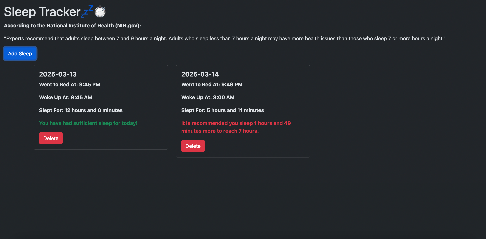

# topicsMidterm
CRUD application for Topics in CS Python Web Development

For my project, I have created a simple and efficient application that allows a user to track their sleep, logging the:

* Date
* Time user went to sleep
* Time user woke up

The application allows the user to save this information, allowing for quick and efficient tracking of their data. 

The application automatically calculates how long the user slept for in **hours** and **minutes**.

The application also automatically calculates if the user has received enough sleep (7 Hours - per recommendation) and alerts the user if they have had enough, or if they have not and states how much longer they should sleep to meet doctor recommendations

**Room for Improvements**

I would love to improve this project:

* Display information in a calendar format
    * Click on an interactable calendar that opens a modal window on a selected date, showing the users sleep information

* Edit button to edit user input after submission